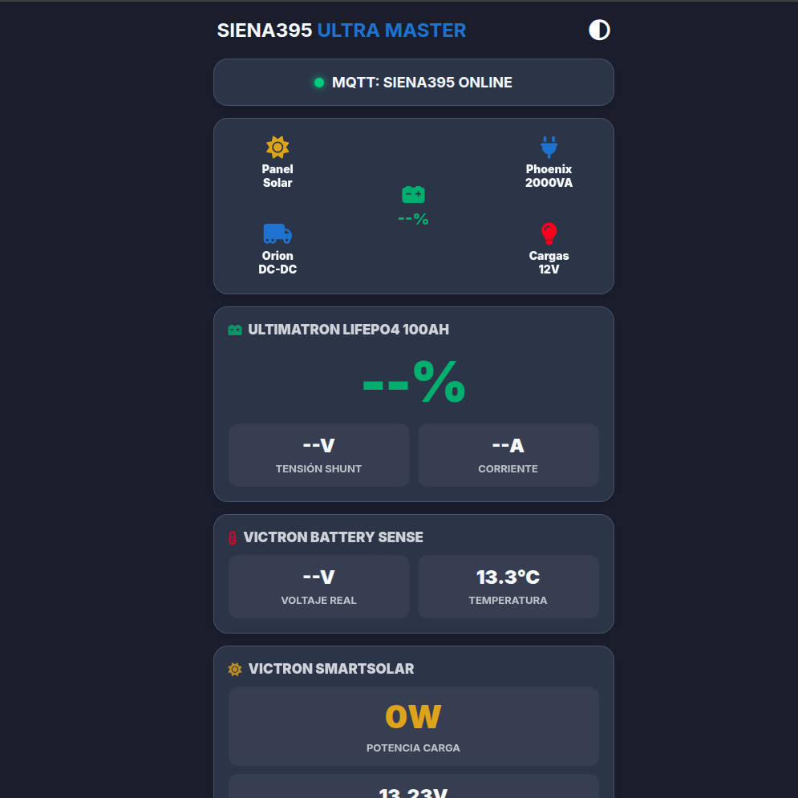

# 🚐 Siena395 Master Ultra - Sistema de Monitorización

Este repositorio contiene el código del Dashboard web para la monitorización en tiempo real de la autocaravana **Siena 395**. El sistema permite visualizar el estado energético de la vivienda desde cualquier lugar del mundo.

## 🔋 Hardware del Sistema
- **Batería:** Ultimatron LiFePO4 100Ah.
- **Cerebro:** ESP32 / ESP32-S3 (Recopilación de datos vía Bluetooth BLE).
- **Equipos Victron:** SmartShunt, MPPT SmartSolar, Orion-Tr Smart y Phoenix Inverter.

## 🚀 Funcionalidades del Dashboard
- **Flujos de energía:** Animación en tiempo real de la dirección de la corriente (Solar, Alternador, Consumos).
- **Indicadores de salud:** Alertas visuales si la batería baja del 20% o la tensión cae de 12.1V.
- **Corriente dinámica:** Los valores de Amperios cambian a verde (carga) o rojo (descarga) automáticamente.
- **Histórico dinámico:** Gráfico de evolución del SOC (%) generado en tiempo real.
- **Diseño Ultra:** Interfaz optimizada para móviles y tablets con modo oscuro.

## 📡 Arquitectura de Datos (MQTT)
- **Broker:** `wss://broker.emqx.io:8084/mqtt`
- **Topic Principal:** `siena395_monitor_mikel_2026/sensor/`

## ⚖️ Licencia
**MONITORIZACIÓN AUTOCARAVANA - Copyleft 2026 UZTURRE - Software Libre.**
Este proyecto se distribuye con la esperanza de que sea útil para otros usuarios de autocaravanas. Se permite su uso, modificación y distribución siempre que se mantenga esta filosofía de libertad.
